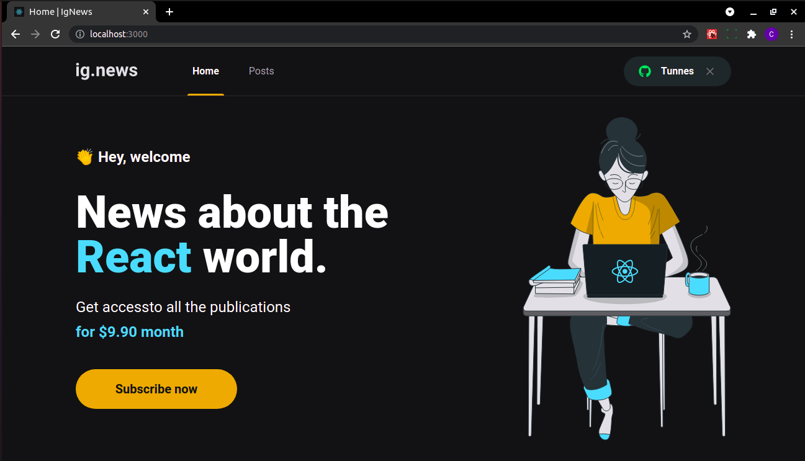

# Projeto IgNews desenvolvido em aula no curso  

## Propósito do Projeto
O IgNews é um Blog de Noticias sobre a tecnologia React

## 📖 Tecnologias utilizadas

* NextJS
* Stripe
* TypeScript
* Handless CMS (Prismic.io)
* FaunaDB
* SaaS
* SASS
* Axios
* Next-Auth

### 
Com a utilização do NextJS o nosso site deixa de renderizar tudo pelo browser, e começa a funcionar através de um back-end (no caso do NextJS ele utiliza o NodeJS).
O NextJS nos permite várias coisas, melhor funcionamento de diretórios, criação de páginas estáticas (GetStaticProps), criação de páginas pelo servidor (GetServerSideProps), webhooks, fácil consumo de API de terceiros e milhões de outras praticidades, porém o maior motivo para se utilizar o NextJS é a renderização do App via Back-End, algo que melhora até o trabalho dos motores de buscas para achar e divulgar seu site.

### 
O Stripe é uma infraestrutura de pagamentos (uma das mais utilizadas atualmente) e com fácil implementação, no nosso projeto criamos uma assinatura mensal onde após fazer a assinatura e ter o cartão aprovado o usuário tem total acesso ao nosso portal de notícias. Dá para fazer vários pagamentos com Stripe (Cartão / ApplePay / Boleto e muitos outros) e várias validações, resgate de dados e etc (Precisamos de um DB para armazenar os dados de pagamento e usuário).

### 
Um Handless CMS é um dashboard que facilita a adição de conteúdo em nossos sites. O prismic foi utilizado apenas para armazenar os conteúdos dos nossos Posts e trazer as páginas isoladas de cada Post.

### 

### To DO

